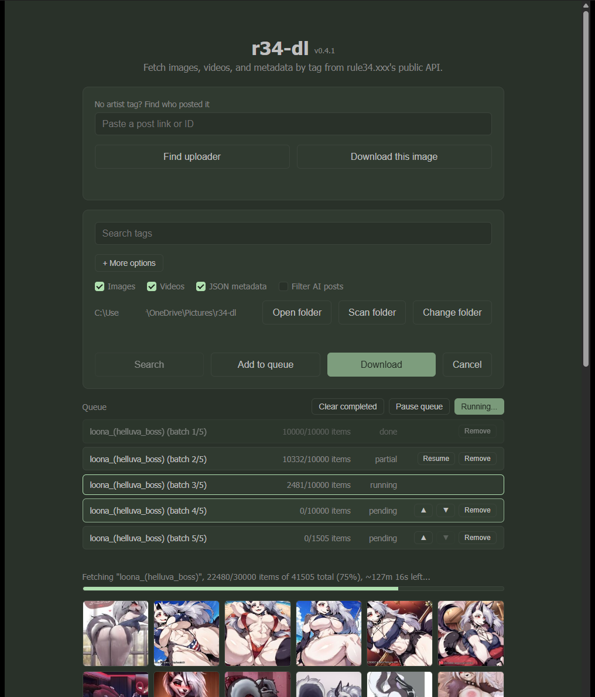

# r34-dl

A small desktop app that fetches images, videos, and metadata from rule34.xxx by search tag, using the site's official public API. No browser automation, no scraping.



## Features

- Paste your API credentials once, then just type a tag and download
- Search first to see the result count and a preview before committing to a full download
- Exclude tags from a search without learning the site's `-tag` syntax, plus a one-click toggle to filter out AI-generated posts
- Find who posted a specific image (no artist tag needed) and jump straight to everything else they've posted
- Download a single image directly from its post link, no tag search needed
- Cap a huge search to a batch size, and it's automatically split into queued chunks; hitting Download on a batched search queues the whole plan and starts it right away, so it's always visible in one place instead of vanishing into a one-off run
- Queue rows show live progress against each batch's own range, not the whole search's total, and gray out once a batch is already fully covered by existing downloads
- Pause a running queue at any point, and resume individually any batch that got interrupted, cancelled, or errored out
- Cancel a search or download at any time
- The same post found under two different searches (a tag and its uploader, for example) is copied locally instead of downloaded twice
- Resuming a tag you've already partly downloaded skips straight to roughly where you left off instead of re-walking every already-seen page
- Scan the download folder to rebuild the dedup index, for downloads that predate it or a folder moved from elsewhere
- Native folder picker to choose where downloads go, plus a button to open it directly
- Downloads images and/or videos, with metadata saved to JSON
- Automatically paginates through all results for a tag
- Skips files already downloaded, even across app restarts
- Sorts everything into `<your folder>/<tag>/images`, `<your folder>/<tag>/videos`, `<your folder>/<tag>/<tag>_data.json`
- Live progress bar with an ETA, and a thumbnail preview as results come in
- Handles API rate limiting automatically
- Checks for new releases on startup and can install updates itself
- Dark theme matching rule34.xxx's own color scheme

## For users: just run the app

Grab the latest installer from [Releases](https://github.com/AiintNoWayy/r34-dl/releases) (or ask whoever built it for the `.exe`/`.msi` file), run it, and skip to [First run](#first-run) below. No Node.js or Rust needed to just use the app.

## For developers: build from source

### Requirements

- [Node.js](https://nodejs.org/) 18 or newer
- [Rust](https://www.rust-lang.org/tools/install) (stable toolchain)
- On Windows, [WebView2](https://developer.microsoft.com/microsoft-edge/webview2/) (preinstalled on most Windows 10/11 systems)
- A free rule34.xxx account (needed for API access)

### Setup

```bash
git clone https://github.com/AiintNoWayy/r34-dl.git
cd r34-dl
npm install
```

Run in development mode (hot-reloads on save):
```bash
npm run tauri dev
```

Or build a standalone installer:
```bash
npm run tauri build
```
The installer lands in `src-tauri/target/release/bundle/` (`.msi` and `.exe` on Windows).

## First run

The app will ask for your API credentials the first time it opens:

1. Log in to your account at [rule34.xxx](https://rule34.xxx)
2. Go to **My Account → Options** (`https://rule34.xxx/index.php?page=account&s=options`)
3. Under **API Access Credentials**, tick **"Generate New Key?"** and save. This reveals a box with `&api_key=...&user_id=...`
   - ⚠️ Only generate a key once. Requesting multiple keys can get your account suspended.
4. Paste that whole box content into the app's setup screen as-is. It parses out both values for you.

## Usage

Type your search tags (and optionally tags to exclude, or a batch limit under **+ More options**), pick what to grab (images / videos / JSON), optionally change the download folder, then either:

- Hit **Search** to see the result count and a preview first, or
- Hit **Download** to go straight to fetching everything, or
- Hit **Add to queue** to stack up several searches and run them later with **Start queue**.

Set a batch limit and either button splits the search into that many queued chunks instead of one long run: hitting Download queues the whole plan and starts it immediately, so you can watch it in the same list you'd use for a manually queued batch, pause it, or come back and pick up any chunk that didn't finish. Batches already covered by what's on disk show up grayed out rather than being silently skipped.

Progress, ETA, and a thumbnail preview update live as items come in. Hit **Cancel** at any time to stop, or **Pause queue** to stop between queue entries without losing your place. Re-running the same tag later only fetches what's new, picking up close to where it left off, and a post that turns up again under a different search is copied from its first download instead of being fetched again.

No artist tag on an image? Paste its post link or ID into the "Find who posted it" field to look up the uploader, then either use the "Use as search" button to fetch everything else they've posted (searches `user:<name>` under the hood), or hit **Download this image** to grab just that one file.

## Disclaimer

rule34.xxx hosts NSFW (not safe for work) content. This tool is provided for personal, educational use. You're responsible for using it in a way that respects rule34.xxx's terms of service and applicable law.

## License

MIT. See [LICENSE](LICENSE).

## Credits

Built by [AiintNoWayy](https://github.com/AiintNoWayy).
